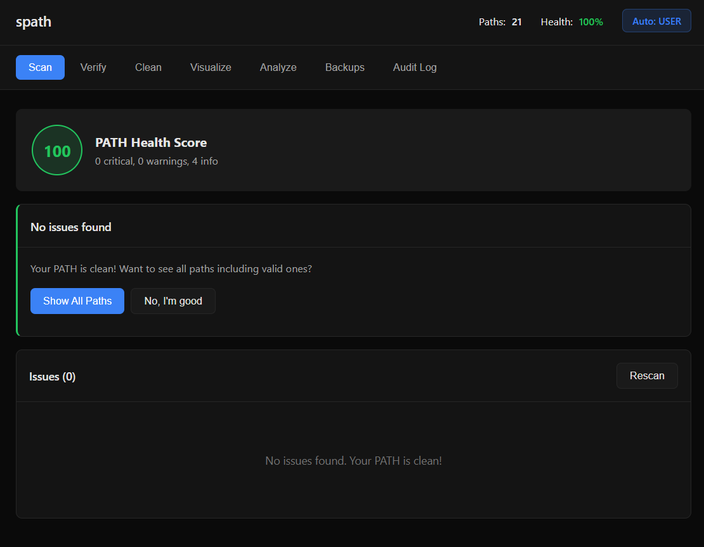
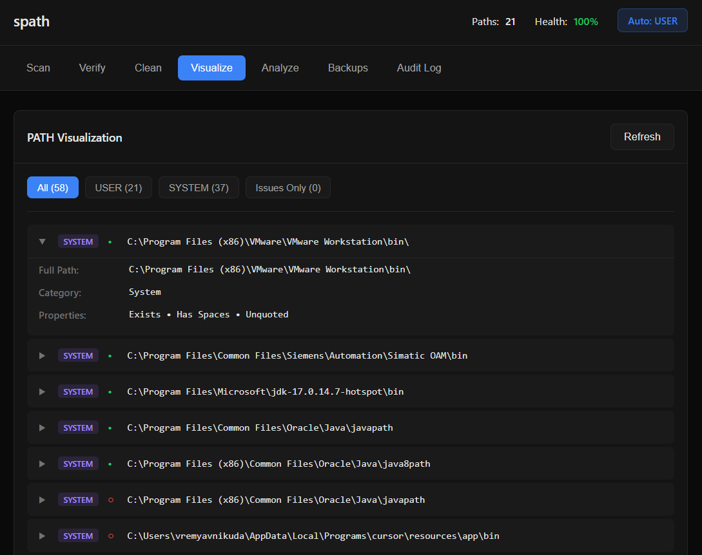
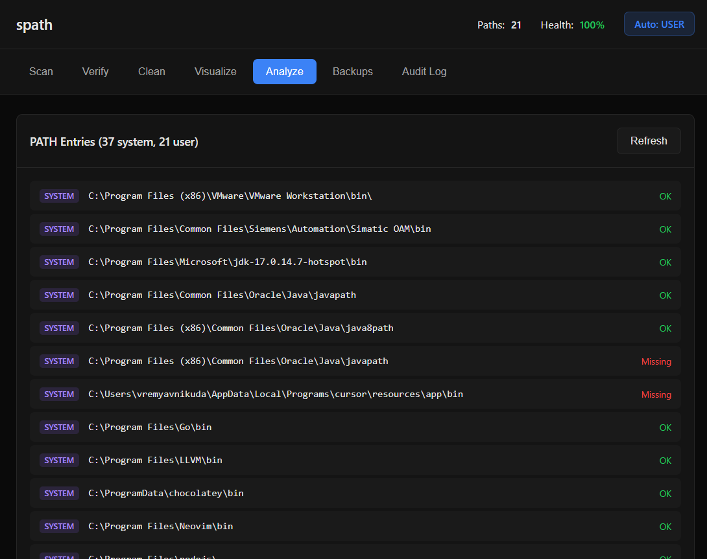
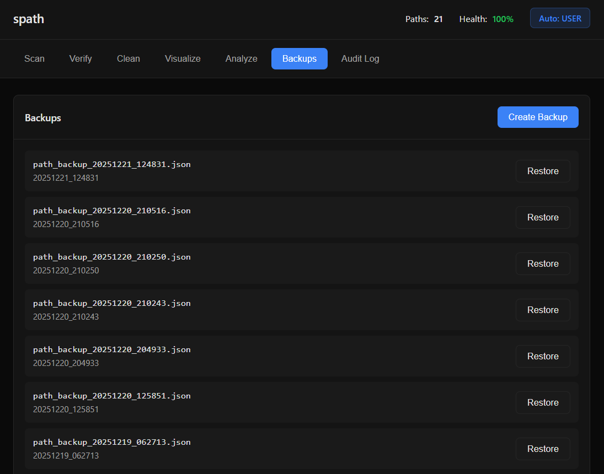
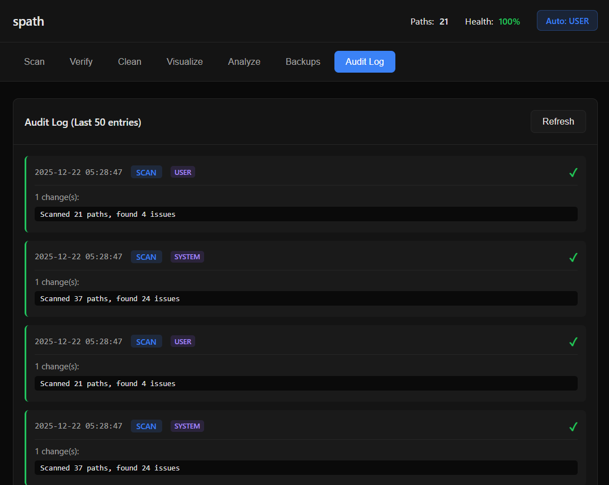

# spath

Windows PATH security scanner and optimizer with graphical interface.

> **GUI version of [spath CLI](https://github.com/vremyavnikuda/spath_cli)**

## Screenshots

<table>
  <tr>
    <td></td>
    <td></td>
  </tr>
  <tr>
    <td></td>
    <td></td>
  </tr>
  <tr>
    <td colspan="2" align="center"></td>
  </tr>
</table>

## Features

- **Scan** - Analyze PATH for security issues and vulnerabilities
- **Verify** - Check if unquoted paths are actually exploitable
- **Clean** - Remove duplicate entries and optimize PATH
- **Visualize** - Interactive tree view of PATH structure with filters
- **Backup & Restore** - Create and restore PATH backups
- **Audit Log** - Track all changes made to PATH
- **Smart Mode** - Automatic suggestions based on scan results

